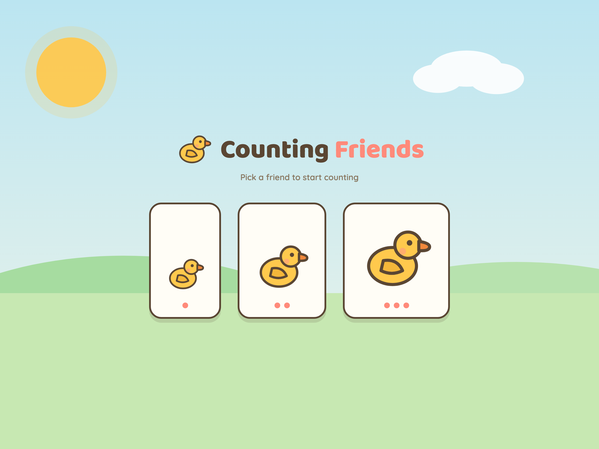
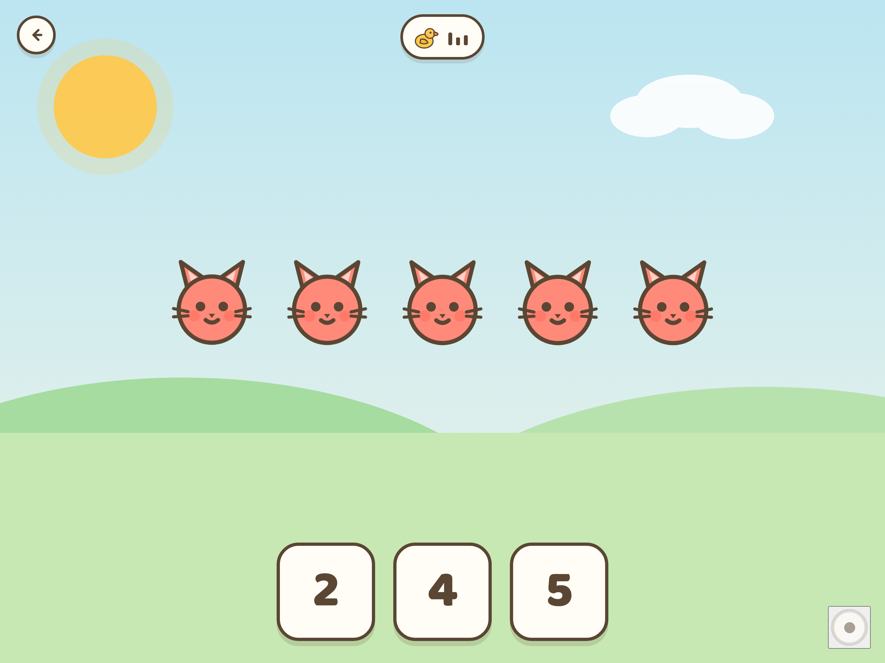
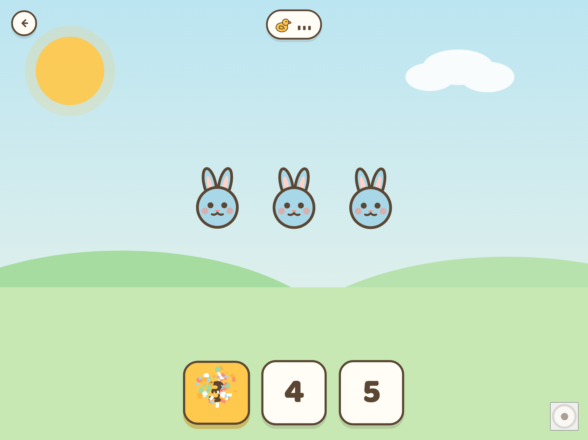
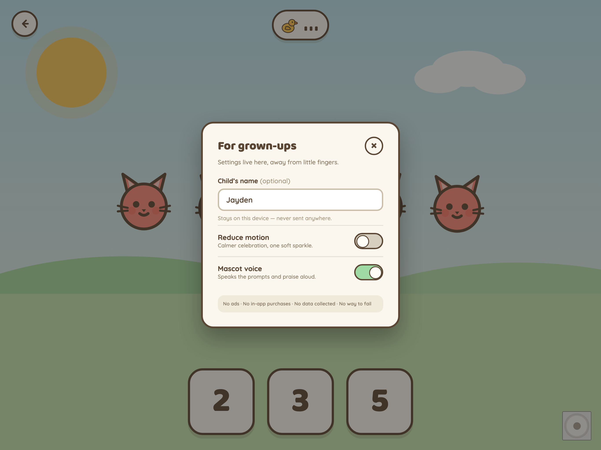

# Counting Friends

**A calm, no-fail tap-to-count game for pre-readers.**

A few friendly animals wander onto a soft meadow, a warm voice asks _"How many ducks?"_, and your child taps the matching big number — celebrated with confetti every time, punished never.


> **No ads · No in-app purchases · No data collected · No way to fail.**

---

## Screenshots

|                                                                                                                      |                                                                                                                        |
| -------------------------------------------------------------------------------------------------------------------- | ---------------------------------------------------------------------------------------------------------------------- |
|          |  |
| **Start** — pick a tier by tapping one of three duck sizes. No reading required.                                     | **Counting** — a warm voice asks "How many?" and your child taps the matching number.                                  |
|  |                               |
| **Celebration** — every correct answer bursts into confetti, a squash-and-stretch, and spoken praise.                | **Settings** — behind a press-and-hold parental gate: name, reduce motion, and voice.                                  |

---

## What it is

Counting Friends is a single-screen counting toy for children roughly ages 3–5, the years when a child can recite "1, 2, 3" by rote long before they understand that _three cats_ means tapping the numeral **3**. It teaches that one-to-one correspondence — set to digit — through play, not testing: there is no score, no timer, no losing, and nothing to read. Every session is a string of small wins.

**Who it's for.** Pre-readers who tap before they read and love animals — and the parents searching the store for a calm, ad-free, zero-data learning app they can hand over without worrying about what their child might find.

---

## The four promises

This is the whole point. Counting Friends is built so a parent can trust it on sight.

- **No ads.** None. No banners, no interstitials, no "watch a video to continue." Nothing is ever sold to your child's attention.
- **No in-app purchases.** One honest price, then nothing. No unlock screens, no "premium," no surprise charges behind any tap.
- **No data collected.** The app collects, stores, and transmits nothing about you or your child to any server, ever. Your preferences stay on the device. See [`privacy.html`](public/privacy.html).
- **No way to fail.** No score, no timer, no streak to lose, no red X, no buzzer. A wrong tap just wobbles gently and the question is asked again. The child can play forever.

---

## Play it

**Live demo:** **https://dsamin.github.io/counting-friends/**

On an iPad, use **Share → Add to Home Screen** to install it as a full-screen, offline toy. Once it has loaded, it runs with no network connection at all.

---

## Features

- **Three difficulty tiers** that grow with your child: **Easy (1–5)**, **Medium (1–10)**, **Hard (1–20)** — chosen on a wordless start screen by tapping one of three duck sizes.
- **Four animal friends** — Dot the duck, Pip the cat, Hopper the frog, and Momo the bunny — that rotate each round so play stays fresh. Tap any animal and it makes its sound.
- **Completely wordless play.** No on-screen text in the child-facing UI. Everything is conveyed by picture, size, color, and voice.
- **Voice prompts and a generous celebration.** A warm voice asks the question, and correct answers burst into confetti, a squash-and-stretch, and spoken praise — optionally by name.
- **A real parental gate.** The only grown-up corner (settings) sits behind a 3-second press-and-hold, never a one-tap "Are you a grown-up?" dialog.
- **Works offline.** Installable PWA; all art, audio, and fonts are bundled. Zero runtime network calls.
- **Accessibility-first.** Honors reduce motion, ships VoiceOver/aria labels, uses an aria-live prompt, traps focus in the gate, and uses large forgiving targets.

---

## Tech stack

- **React 18 + TypeScript** built with **Vite**.
- **[vite-plugin-pwa](https://vite-pwa-org.netlify.app/)** for the installable, offline service worker and web manifest.
- **Vitest** + Testing Library for unit/component tests; **Playwright** for end-to-end and screenshot flows.
- **Self-hosted fonts** (Baloo 2, Quicksand via `@fontsource`) — no Google Fonts request at runtime.
- **Zero runtime network.** No analytics, no SDKs, no third-party scripts. Once cached, nothing leaves the device.

---

## Getting started

```bash
npm install         # install dependencies

npm run dev         # start the dev server (Vite)
npm run build       # typecheck + production build into dist/
npm run preview     # preview the production build locally

npm run test        # run the unit/component suite (Vitest)
npm run e2e         # run the Playwright end-to-end + screenshot specs

npm run lint        # ESLint
npm run typecheck   # tsc --noEmit
```

The app deploys to GitHub Pages under the base path `/counting-friends/`.

---

## Project structure

```
src/
├── game/         pure game logic — round generation, state machine, persistence
│   ├── round.ts        count + choice generation, sizing, praise/prompt lines
│   ├── gameState.ts    the reducer + GameState shape (state machine)
│   ├── useGame.ts       React hook binding state to timers + audio
│   ├── constants.ts     timings, confetti, speech, words, praise (source of truth)
│   ├── persistence.ts   cf_* localStorage read/write (the only stored values)
│   ├── characters.ts    the four animal friends + sounds
│   └── reduceMotion.ts  prefers-reduced-motion wiring
├── audio/        webAudioEngine.ts — WebAudio SFX + speech synthesis
├── components/   NumberButton, Confetti, ParentalGate, SettingsSheet, Scene, …
├── screens/      StartScreen (tier select), PlayScreen (the loop)
├── styles/       tokens.css + app.css + index.css (the styling source of truth)
└── main.tsx      app entry

assets/           production SVG/PNG asset library (icons, characters, marketing)
e2e/              Playwright flows + screenshot specs
docs/             store listing, SwiftUI port handoff, screenshots
public/           static files copied verbatim to the site (incl. privacy.html)
```

---

## Testing

The suite is **148 unit/component tests (Vitest)** plus **Playwright** end-to-end and screenshot flows. The game logic in `src/game/` is test-driven, including invariant fuzz tests — for example, that every generated round always contains the correct answer, that distractors are unique and in range, and that choices are sorted so position never leaks the answer. Run `npm run test` for the unit suite and `npm run e2e` for the browser flows.

---

## Accessibility

- **Reduce motion** is honored — the confetti burst downgrades to a few calm sparkles and the auto-advance shortens. The toggle also defaults from the OS `prefers-reduced-motion` setting.
- **VoiceOver / aria labels** on number buttons ("number three") and controls; the decorative confetti canvas is `aria-hidden`.
- **An aria-live region** announces the spoken prompt so assistive tech tracks the question.
- **The parental gate traps focus** while open so a child can't tab out of the grown-up area unexpectedly.
- **Large, forgiving targets** — number buttons and animals are well above the 44pt minimum; feedback never relies on color alone (motion + sound + voice carry it).

---

## Privacy

Counting Friends collects, stores, and transmits **nothing**. There are no accounts, no analytics, no ad networks, and no network calls at all once the app has loaded. The only values saved are your own preferences — chosen difficulty, an optional child's name, and the reduce-motion and voice toggles — kept in local storage on your own device and never sent anywhere. The full, plain-language policy is hosted at [`public/privacy.html`](public/privacy.html) (live at `https://dsamin.github.io/counting-friends/privacy.html`).

---

## Roadmap

- **More animal worlds** (farm, ocean, jungle) shipped as free updates.
- **Count-up mode** — tap each animal in turn and hear the running count spoken.
- **A second-language voice track** (Spanish first) — cheap reach, since there's almost no on-screen text.
- **The native SwiftUI iPad app** — the ultimate target for the App Store Kids Category, with Core Haptics and pre-recorded voice. See the engineering handoff in [`docs/SWIFTUI-PORT.md`](docs/SWIFTUI-PORT.md).

---

## License

Proprietary — Copyright © 2026 Devan. All rights reserved. The source is published publicly for reference and transparency, but is **not** licensed for reuse, redistribution, or derivative works. See [`LICENSE`](LICENSE).

---

## Credits

Design system, characters, and the full asset library come from the project's brand sheet. The palette, typography (Baloo 2 + Quicksand), and motion tokens live in [`src/styles/tokens.css`](src/styles/tokens.css); the asset inventory is documented in [`assets/README.md`](assets/README.md).
